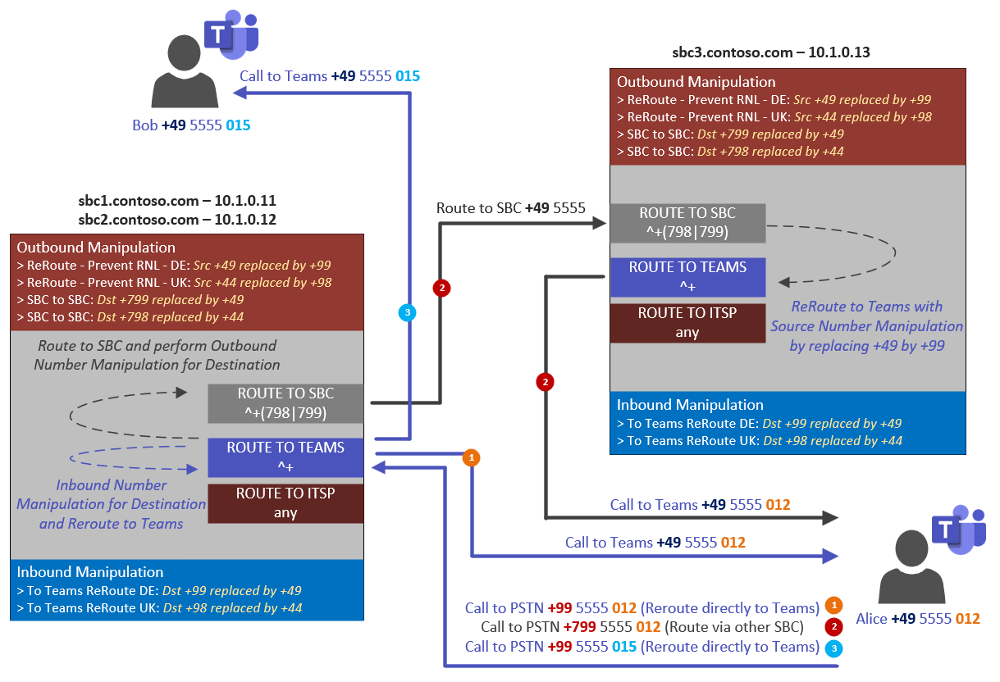

# auto-deploy-azure-teams-direct-routing-lab

☝ `This lab does not provide real-world scenarios, it just demonstrates some "special/fictional" call scenarios (looping/rerouting and number manipulation) helping you to start playing around and getting familiar with Teams Direct Routing without going for Telco SIP Trunk actually required to connect to the PSTN.`

## Table of Contents

- [About The Project](#1-about-the-project)
- [Prerequisites](#2-prerequisites)
- [What the script does](#3-what-the-script-does)
- [Script Folder Structure](#4-script-folder-structure)
- [Azure Lab Setup Overview](#5-azure-lab-setup-overview)
- [Teams Direct Routing Config](#6-teams-direct-routing-config)
- [Call Scenario Examples](#7-call-scenario-examples)
- [Run Script to deploy Resources](#8-run-script-to-deploy-resources)
- [Setup Step by Step for SBC](#9-setup-step-by-step-for-sbc)
- [Setup Step by Step for Teams](#10-setup-step-by-step-for-teams)

## 1 About The Project

This guide will help for setting up a self-paced Teams Direct Routing Lab in Azure by using the given script
> <https://docs.microsoft.com/en-us/microsoftteams/direct-routing-landing-page/>

The main idea of this setup is to use Direct Routing **without going for real/public SIP Trunk (Telco) and PSTN connectivity**, instead we make use of number manipulation and re-routing logic (looping).

In fact, we do route calls from Teams to the SBC and then looping/routing them back to Teams. The key is to avoid RNL (Reverse Number Lookup) when dialing numbers - this is where number manipulation comes into place.

## 2 Prerequisites

To run the script successfully you have to check the following requirements:

- `Azure Subscription`
- `Office 365 Tenant with Phone System License` (including provisioned Teams Users)
- `Custom Domain` registered with O365 and with access to DNS -> needed to add public A-Records per SBC
- `Public Certificate` -> personal recommendation is using wildcard such as *.contoso.com

You also have to install the following PowerShell Modules (Az + Teams):

```powershell
Install-Module -Name Az -Scope CurrentUser
Connect-AzAccount
Select-AzSubscription
```

```powershell
Install-Module -Name MicrosoftTeams -Scope CurrentUser
Connect-MicrosoftTeams
```

## 3 What the script does

1. `Deploying Azure Resource Group` with pre-defined network config
2. `Creating 3 SBCs (AudioCodes) including ready-to-use config INI` file (with prepared profile for ITSP in case you want to go for real SIP Trunk). The config file then needs to get imported manually.
3. `Creating 1 Windows Admin Machine for Syslog`, as well providing you a hub to do SBC administration.
4. Configuring Teams Direct Routing Setup (`PstnUsage, VoiceRoutingPolicy, PSTNOnlineGateways`) -> providing the commands ready to run via Teams PowerShell manually.

## 4 Script Folder Structure


The template folders include all templates – in case you are going for the scenario/playbook within that guide, then you don’t have to change something from there. Parameter such as naming etc. can be adjusted within the Main PowerShell scripts.

When completed you will get some more files created in the root folder – with these files we will then further proceed to configure the setup, such as configuration for DNS, SBC and Teams.


## 5 Azure Lab Setup Overview

The given script will create a new Azure Resource Group with a predefined VNET, including a single NSG to provide Layer 3/4 Firewalling. It will further install 3 SBCs based on AudioCodes and 1 Windows Server as Admin Machine which will also act as Syslog Server.


```diff
+ ⚠ Note: 
+ The machines are not coming with configured Auto Shutdown. 
+ With that in mind, keep an eye to running state and consider shutting down when not used.
```

> <https://docs.microsoft.com/en-us/shows/it-ops-talk/auto-shutdown-and-auto-start-an-azure-vm/>

```txt
  sbc1: 10.1.0.11 (Primary Trunk DE)
  sbc2: 10.1.0.12 (Primary Trunk DE)
  sbc3: 10.1.0.13 (Primary UK, Backup DE, Disaster Recovery Scenario)
  admin-syslog: 10.1.0.10 (Administration, Syslog)
```

In addition, the script will create Static Public IPs and assigning them automatically to the SBCs, as well to the Admin Machine for RDP connectivity purpose.

The Windows Admin Machine will `listen on a random RDP port` to provide some `Security by Obscurity` – from here you can manage/setup your lab environment. The RDP listening port will be configured/changed by the admin machine post setup script running at the end of the deployment.

```diff
- ⚠ Note: 
- I would highly recommend going for P2S VPN instead of exposing RDP connectivity from external - especially when you want to have the lab for longer time. 
- You should also have a look to Azure Bastion, as well to Just-in-Time access to proper secure general access to your VM.
```

> 👉 More information for how to securely access your machine can be found here: <br/>
[Azure Just-in-time access](https://docs.microsoft.com/en-us/azure/defender-for-cloud/just-in-time-access-usage)<br/>
[Azure Bastion](https://docs.microsoft.com/en-us/azure/bastion/bastion-overview)<br/>
[Azure P2S VPN](https://docs.microsoft.com/en-us/azure/vpn-gateway/point-to-site-about)


The next picture shows the Network Security Group to allow/block traffic. Here you can also see the Random RDP port which is used to connect to your Admin Machine from external.

The SBCs are configured to use listen on port 5067 for SIP traffic. If you want to change, simply adjust the INI file by changing the used Signaling Port per SIP Interface – the same applies for the RTP ports which you can customize via Media Realm settings.

> 👉 More information about Signaling and Media Ports, as well endpoints can be found here: <br/>
<https://docs.microsoft.com/en-us/MicrosoftTeams/direct-routing-plan#sip-signaling-ports/>

```diff
+ ⚠ Note: Always make sure that your port configuration on SBC side is in line with your Network Security Group configuration.
```


The below finally shows all resources the script will deploy:


## 6 Teams Direct Routing Config

The script will also provide you the proper commands to configure Direct Routing from Teams side. The below is what you will get – here you could adjust naming, as well numbers to something which is more familiar for you.

With that, we have 2 user profiles according to the created Voice Routing Policies you then can assign to your lab users.


## 7 Call Scenario Examples

The main principle for this lab is to make use of number manipulation and re-routing. This has the benefit that you don’t have to go for some "real" SIP Trunk. In fact, we are simulating PSTN Calls be forcing Teams-to-Teams call going through your SBCs and Direct Routing infrastructure.

```diff
+ 👉 Tip: With that you could also playing around with just a single Teams User/Client:
```

  1. Call to yourself – to at least check for SBC routing functionality and ringing

  2. Call to yourself by having voicemail forwarding active (with that you could also check for media functionality)

```diff
+ ⚠ Note: 
+ Keep in mind, to place outbound PSTN calls we need to make sure that RNL (Reverse Number Lookup) is not kicking in. 
+ This is also the reason why you may want to dial with a prefix to avoid RNL matching. 
+ Alternatively you could dial a number not assigned to any user and doing special number manipulation on SBC side again. 
```

Typically, I am going for `+99 to force PSTN Call and to avoid RNL matching` – with that we only need to re-manipulate this back on SBC side to provide proper re-routing to Teams.



The above picture shows the following 3 call scenarios:

> `1 - Call to PSTN by dialing +99 5555 012 (Call to yourself -> Alice to Alice)`

- Due to prefix +99 we don’t have RNL match and so the call is proper routed to SBC side
- The SBC is then performing "Inbound Number Manipulation" for the Destination Number, in fact replacing +99 by +49
- Then the call is routed to Teams and before leaving SBC the Source Number is manipulated by replacing +49 by +99. This will prevent RNL on Teams side again and so we are not getting confused when receiving a call from yourself, as well providing us the possibility to simply call back as the number is show with +99 prefix.

> `2 - Call to PSTN by dialing +799 5555 012 (Call to yourself via other SBC -> Alice to Alice)`

- Due to prefix +799 we don’t have RNL match and so the call is again proper routed to SBC side
- The SBC is not performing "Inbound Number Manipulation" for the Destination Number as we don’t have a match for +799
- The call then is then routed to another SBC (in our case to sbc3) and before leaving SBC the Destination Number is manipulated by replacing +799 by +49.
- The call then comes in on SBC3 which is simply routing the call back to Teams, but before that doing again "Outbound Manipulation" for the Source Number to avoid again RNL on Teams side.

> `3 - Call to PSTN by dialing +99 5555 015 (Call to Bob -> Alice to Bob)`

- Due to prefix +99 we don’t have RNL match and so the call is proper routed to SBC side
- The SBC is then performing "Inbound Number Manipulation" for the Destination Number, in fact replacing +99 by +49
- Then the call is routed to Teams and before leaving SBC the Source Number is manipulated by replacing +49 by +99. This will prevent RNL on Teams side again and so we are not getting confused when receiving a call from yourself, as well providing us the possibility to simply call back as the number is show with +99 prefix.

## 8 Run Script to deploy Resources

First check the parameter and definitions you may want to change/adjust within the PowerShell script.

Usually, you want to change `Location` to a region closer to your physical location, as well `PSTN Location` and the `Dummy Numbers` you want to use. Or if you prefer to re-name the machines, e.g. when the names are already taken within your DNS zone.


After that you are ready to run the script.

```diff
+ ⚠ Note: Before running, verify that you are within correct Azure Subscription Context to get it deployed as expected. 
```

The script will then ask you for the following:

- SIP Domain (not SBC FQDN, instead domain only)
- Local Admin User Name (used for SBCs + Windows Machine)
- Password


```diff
+ 👉 The whole Azure installation will take a approx. 6min to complete.
```

When finished you will get this output providing you the info about what:

- `DNS` you need to configure
- ready to use `INI` file per SBC
- ready to use `Teams PowerShell Commands` to configure Direct Routing
- as well the `RDP File` to access your Admin Machine.


Now we can already add the required DNS records pointing to our recently created SBCs – the required A Records can be found within the highlighted text file.


As my zone is hosted in Azure, I can simply run some AzPowerShell commands to get them added.

```powershell
New-AzDnsRecordSet -Name "sbc1" -RecordType A -ResourceGroupName "RG-DNS" -TTL 1800 -ZoneName "contoso.com" -DnsRecords $(New-AzDnsRecordConfig -IPv4Address 51.116.115.158)
New-AzDnsRecordSet -Name "sbc2" -RecordType A -ResourceGroupName "RG-DNS" -TTL 1800 -ZoneName "contoso.com" -DnsRecords $(New-AzDnsRecordConfig -IPv4Address 51.116.115.172)
New-AzDnsRecordSet -Name "sbc3" -RecordType A -ResourceGroupName "RG-DNS" -TTL 1800 -ZoneName "contoso.com" -DnsRecords $(New-AzDnsRecordConfig -IPv4Address 51.116.115.154)
```

```diff
+ ⚠ Note: 
+ Keep also in mind, that we do need a public certificate from trusted CA. 
+ I usually prefer to use a wildcard for my lab purposes. 
```

`Alternatively, Direct Routing supports a wildcard in the CN and/or SAN, and the wildcard needs to conform to standard RFC HTTP Over TLS. An example would be using *.contoso.com which would match the SBC FQDN sbc.contoso.com, but wouldn't match with sbc.test.contoso.com.`

> 👉 More information about trusted CAs and certificate requirements can be found at:
<https://docs.microsoft.com/en-us/MicrosoftTeams/direct-routing-plan#public-trusted-certificate-for-the-sbc/>

---

## 9 Setup Step by Step for SBC

Now it is time to connect remotely to the Admin Machine by simply using the RDP file.

Here you will then find TEMP folder with browser shortcuts to access the SBCs later, as well some installation files such as Syslog and Teams Desktop Client.


`Do copy all INI Files` from your local to the Admin Machine, as well the Public Certificate (Base64, PEM) to the admin machine to get them imported from there. Do also import the certificate of the signing CA for your public cert.


To do this we will connect to the Admin Web Interface for each SBC (ignore the cert issue your browser is dropping as we are connecting to IP rather than FQDN).


```txt
https://10.1.0.11
https://10.1.0.12
https://10.1.0.13
```

```diff
+ ⚠ Note: Username for the Web Interface is case-sensitive.
```

After successful login to the SBC web interface, we will then import the specific INI files.

```diff
+ ⚠ Note: It is important to choose Auxiliary File to do incremental config changes.
```

This will keep networking config in place. After this click to `SAVE`, but do not yet RESET (Reboot).


We then need to enable `Media Security` manually – again click to `SAVE` without going for an RESET for now.


The last step before restarting the device is to upload our `Public Certificate`, as well the Root/CA Certificates. The Public Certificate will be imported by clicking to `Change Certificate`. The Root Certs needs to get imported via `Trusted Root Certificates`.

> 👉 For DigiCert you can download the trusted root certificates from the below - there you will also find the Baltimore CyberTrust Root: <https://www.digicert.com/kb/digicert-root-certificates.htm/>


> <https://docs.microsoft.com/en-us/microsoft-365/compliance/encryption-office-365-certificate-chains?view=o365-worldwide/>

As always, do not forget about to SAVE when doing the below.


Now finally we are going for `RESET` to burn the config and restarting the SBC. In the meantime, you may want to proceed with the next SBC in the same way.


🔎 After successful reboot and applying the INI to your SBC, we can verify the setup by having a look to some applied settings. So simply check if we have proper new SIP Interfaces (3), Media Realms, Proxy Sets, as well multiple IP-to-IP Routing Rules.

```diff
+ ⚠ Note: ITSP is an optional not used within our demo scenarios, instead already prepared for you in case you want to connect to your Telco SIP Trunk.
```


```diff
+ ⚠ Note: Keep in mind, we only see ONLINE status within ProxySets after having the SBCs added to your Teams Tenant Configuration.
```


## 10 Setup Step by Step for Teams

```text
  1. New-CsOnlinePSTNGateway
  2. Set-CsOnlinePstnUsage 
  3. New-CsOnlineVoiceRoutingPolicy
  4. New-CsOnlineVoiceRoute
  5. Set-CsUser
  6. Grant-CsOnlineVoiceRoutingPolicy
```

```diff
+ ⚠ Note: Don’t forget to first connect to Teams PowerShell.
```

```powershell
Install-Module -Name MicrosoftTeams
Connect-MicrosoftTeams
```

The very first you have to do is to add the SBCs as new PSTN Gateways for your Teams Tenant.

```powershell
New-CsOnlinePSTNGateway -Identity "sbc1.contoso.com" -SipSignalingPort 5067 -FailoverTimeSeconds 5 -ForwardCallHistory 1 -ForwardPai 1 -SendSipOptions 1 -MaxConcurrentSessions 10 -Enabled 1 -MediaBypass 1
New-CsOnlinePSTNGateway -Identity "sbc2.contoso.com" -SipSignalingPort 5067 -FailoverTimeSeconds 5 -ForwardCallHistory 1 -ForwardPai 1 -SendSipOptions 1 -MaxConcurrentSessions 10 -Enabled 1 -MediaBypass 1
New-CsOnlinePSTNGateway -Identity "sbc3.contoso.com" -SipSignalingPort 5067 -FailoverTimeSeconds 10 -ForwardCallHistory 1 -ForwardPai 1 -SendSipOptions 1 -MaxConcurrentSessions 10 -Enabled 1 -MediaBypass 1
```

🔎 Now with having the Gateways added, we can jump back to the SBC side to verify that Proxy Set Status is no showing ONLINE.


You then can add the new PSTN Usages (4) we need for our calling scenarios.

```powershell
Set-CsOnlinePstnUsage -Identity global -Usage @{add="PSTN-USAGE-DE", "PSTN-USAGE-UK", "PSTN-USAGE-DE-VIA-UK", "PSTN-USAGE-LEAST-COST"}
```

The newly added usages will now be assigned to a Voice Routing Policy (2).

```powershell
New-CsOnlineVoiceRoutingPolicy "VOICE-ROUTING-POLICY-DE" -OnlinePstnUsages "PSTN-USAGE-DE","PSTN-USAGE-DE-VIA-UK","PSTN-USAGE-LEAST-COST"
New-CsOnlineVoiceRoutingPolicy "VOICE-ROUTING-POLICY-UK" -OnlinePstnUsages "PSTN-USAGE-UK","PSTN-USAGE-LEAST-COST"
```

The last thing from configuration perspective is to add the proper Voice Routes (4).

```powershell
New-CsOnlineVoiceRoute -Identity "ROUTE-DE-PRIMARY-HA" -Priority 0 -Description "Primary Route to sbc1 and sbc2" -OnlinePstnGatewayList "sbc1.contoso.com", "sbc2.contoso.com" -NumberPattern "^\+(99|49)(\d*)$" -OnlinePstnUsage "PSTN-USAGE-DE", "PSTN-USAGE-LEAST-COST"
New-CsOnlineVoiceRoute -Identity "ROUTE-DE-BACKUP-DR" -Priority 1 -Description "Backup Route to sbc3" -OnlinePstnGatewayList "sbc3.contoso.com" -NumberPattern "^\+(99|49)(\d*)$" -OnlinePstnUsage "PSTN-USAGE-DE-VIA-UK"
New-CsOnlineVoiceRoute -Identity "ROUTE-UK-PRIMARY" -Priority 2 -Description "Primary Route to sbc3" -OnlinePstnGatewayList "sbc3.contoso.com" -NumberPattern "^\+(98|44)(\d*)$" -OnlinePstnUsage "PSTN-USAGE-UK","PSTN-USAGE-LEAST-COST"
New-CsOnlineVoiceRoute -Identity "ROUTE-FORCED-SBC-TO-SBC" -Priority 4 -Description "Route via SBC to SBC" -OnlinePstnGatewayList "sbc1.contoso.com", "sbc2.contoso.com", "sbc3.contoso.com" -NumberPattern "^\+(798|799)(\d*)$" -OnlinePstnUsage "PSTN-USAGE-UK"
```

Now you are ready to prepare your users:

- Assign proper calling `licenses`
- Upgrade to `TeamsOnly` if not yet done
- Enable for Phone System and specify Phone Number aka `LineURI`
- Assign `Voice Routing Policy`

```powershell
Get-CsOnlineUser -Identity "john.doe@contoso.com" | Grant-CsTeamsUpgradePolicy -PolicyName UpgradeToTeams
Set-CsUser "john.doe@contoso.com" -EnterpriseVoiceEnabled $true -HostedVoiceMail $true -OnPremLineURI "tel+495555012"
Grant-CsOnlineVoiceRoutingPolicy -PolicyName "VOICE-ROUTING-POLICY-DE" -Identity "john.doe@contoso.com"
```

> 👉 Phone Number assignment has changed - make sure you have purged `LineUri` attribute in on premises before assigning phone number via new `Set-CsPhoneNumberAssignment` cmdlet:

```powershell
Set-CsPhoneNumberAssignment -Identity "john.doe@contoso.com" -PhoneNumber "+495555012" -PhoneNumberType DirectRouting
```

```diff
+ If OnPremLineUriManuallySet is set to False and LineUri is populated with a <E.164 phone number>, the phone number was assigned on-premises and synchronized to Microsoft 365. If you want to manage the phone number online, clean the parameter using on-premises Skype for Business Management Shell and synchronize to Microsoft 365 before configuring the phone number using Teams PowerShell.
```

> <https://docs.microsoft.com/en-us/microsoftteams/direct-routing-enable-users#ensure-that-the-user-is-homed-online/>

You can verify the user provisioned status via:

```powershell
Get-CsOnlineUser "john.doe@contoso.com" | select SipAddress,DisplayName,OnlineVoiceRouting*,*LineUri*,EnterpriseVoice*,RegistrarPool,TeamsUpgradeEffectiveMode
```

👉 More information for how to enable users for Direct Routing can be found at:

> <https://docs.microsoft.com/en-us/microsoftteams/direct-routing-enable-users/>

> <https://docs.microsoft.com/en-us/MicrosoftTeams/direct-routing-plan#licensing-and-other-requirements/>

## License

Distributed under the MIT License. See `LICENSE` for more information.
